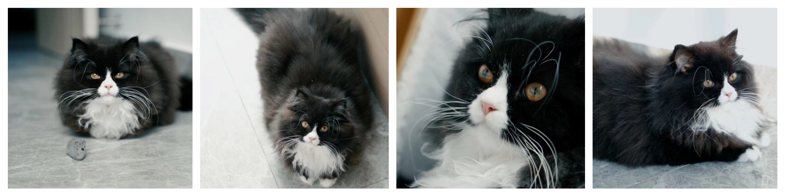
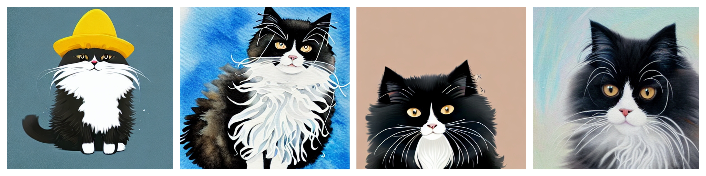

### Task 1: General cultural image task


#### inference

```shell
python txt2img.py --prompt [input text] --ckpt_path [ckpt_path] --ckpt_name [ckpt_name] \
--H [image_height] --W [image_width] --output_path [image save folder] \
--n_samples [number of images to generate]
```
or
```shell
bash scripts/run_txt2img.sh
```

#### train

```shell
bash scripts/run_train.sh
```

### Task 2: Personalized text and image task

Based on 3-5 photos of the same subject, after 25-35 minutes of personalized fine-tuning, a customized image generation model for the subject can be obtained.

Train data：



Effect display



#### train


```shell
bash scripts/run_db_train.sh
```

#### inference

```shell
bash scripts/infer.sh
```
